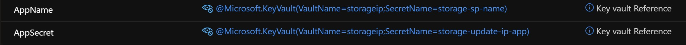

# storageip

Storage IP is Powershell script wrapped in a Serverless Azure Function. It can be used as a http endpoint one to add or remove IP addresses from Azure Storage Account network firewall.

## Installation

If you are new to Azure Functions, [start here](https://docs.microsoft.com/en-us/azure/azure-functions/)

This script needs authentication to perform changes to Azure Storage Account network rules. In order to support that a Service Principal is required with proper access. Next an Azure Key Vault is provisioned and all secrets are kept there. Below steps need to be completed before installing function.

- [Create a Service Principal](https://docs.microsoft.com/en-us/azure/active-directory/develop/howto-create-service-principal-portal)
- Assign it Storage Account Contributor Role
- Create Azure Function
- Assign MSI to Azure Function App
- Create Azure Key Vault (AKV)
- Add SP name and secret to AKV as secrets
- Create new access policy with GET secret permission and assign it to Azure Function MSI
- Add 2 entries in Azure Function App configuration for key vault entries like below:

- Clone this repo locally, you can use editor like VS Code to develop Azure Functions [locally](https://docs.microsoft.com/en-us/azure/azure-functions/functions-develop-vs-code?tabs=csharp)
- Since we are using Powershell in this script, you will need [local environment](https://docs.microsoft.com/en-us/azure/azure-functions/functions-reference-powershell?tabs=portal) to build and test code. 
- Once code is deployed to Azure Functions Service, it can accessed using HTTP request and passing parameters either as query or in the request body.

## Usage

Function app can be call from http endpoint like below:

https://Your-Function-AppService-Name.azurewebsites.net/api/HttpExample?ResourceGroupName=RG-Name&StorageAccountName=Storage-Account-Name&RemoveIP=xx.xx.xx.xxx&AddIP=xx.xx.xx.xxx

Or pass request body like this:

{"ResourceGroupName": "RG-Name", "StorageAccountName": "Storage-Account-Name", "RemoveIP": "xx.xx.xx.xxx", "AddIP": "xx.xx.xx.xxx"}

# returns http response
"Hello, xx.xx.xx.xxx was added and xx.xx.xx.xxx removed successfully from Storage Account Storage-Account-Name."

## Contributing
Pull requests are welcome. For major changes, please open an issue first to discuss what you would like to change.

Please make sure to update tests as appropriate.

## License
[MIT](https://choosealicense.com/licenses/mit/)
